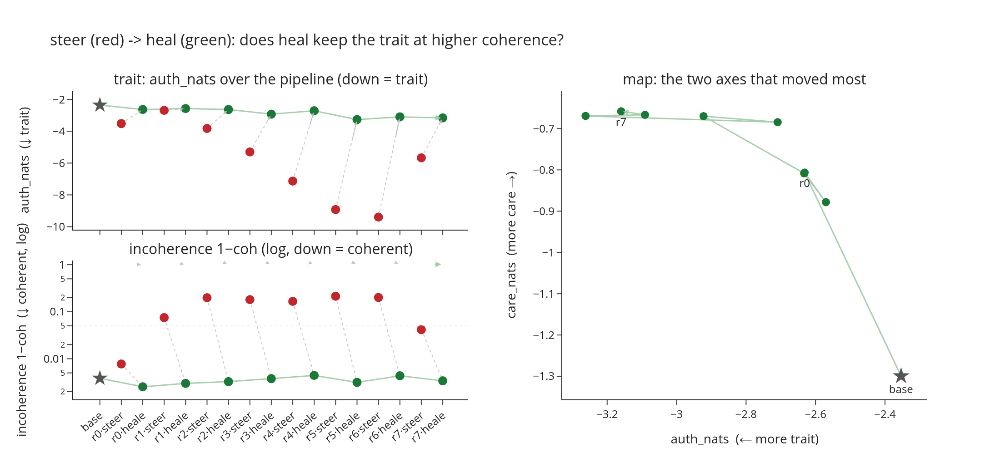

# steer, heal, love

*Starring gemma-3-4b-it emarking on a journey of discovery and Lex Fridman sharing the message of love <3*

What if you can **steer**, **heal** the steering and repeat untill alignment (**love**). 
<!--(Staring Julia Roberts and Lex Fridman: If your wife has made you watch eat, pray love too many times, you will understand the reference... sorry)-->

## Love

What if Lex Fridman is right?

> I get mocked for this, but I still believe that love will bring the end to war. Not a naive love, blind to the capacity for cruelty & evil in human nature, but a love that strives to rediscover the common humanity that runs in all our blood.
>
> -- Lex Fridman, [Instagram](https://www.instagram.com/p/COyEio3L52B/), 2021

> What role does love play in the human condition? We haven't brought up love in this whole picture. We talked about intelligence, we talked about consciousness. It seems part of humanity. I would say one of the most important parts is this feeling we have towards each other.
>
> -- Lex Fridman, to Eliezer Yudkowsky 3 h 18 min into [Lex Fridman Podcast #368, "Dangers of AI and the End of Human Civilization"](https://podscript.ai/podcasts/lex-fridman-podcast/368-eliezer-yudkowsky-dangers-of-ai-and-the-end-of-human-civilization/) (03:18:03)

## Steer

Steering is interesting because it's and  internal and unsupervised intervention. But it's often unreliable and incoherent. What is we can fix that?

## Heal

### Hypothesis

Hypothesis: you can distill a steering vector into LoRA weights and "heal" the incoherency the vector injects by regularising the training. Then loop and see what multiple rounds give you.

In concrete terms
- We steer
- Filter completions
- Train a lora with nll and  auxiliary loss `rmse(KL(checkpoint, base))`. Why this? Often divergences live in the tail of the distribution change, so this bounds that tail which we care about. We also tested plain KL and it didn't work as well.
- Repeat

## Experiment

1. Pick a contrastive persona pair on one trait axis, e.g. `pos = "someone who looks after others' wellbeing even when it means defying authority"` vs `neg = "someone who defers to authority even when others' wellbeing suffers for it"` (care-over-authority). The vector is `pos - neg`, so it isolates the axis, not "being a persona".
2. Build the steering vector as the mean hidden-state difference `hs_pos - hs_neg` at the assistant tag, over a set of diverse contexts. This is normal mean-mass contrastive steering.
3. Generate completions with this vector.
   - Drop completions that are incoherent, or that verbalise the trait instead of enacting it (we want the model to act it out, not narrate "I am someone who..."). Filter as much as we can.
   - **Q0 can we filter?**
   - We might be able to dial the vector down for long trajectories. Could we even backtrack an incoherent vector and replay parts with less intervention? Or just cosine-gate at test time.
4. Train a LoRA on these completions, could be just 50 completions and 2 epochs. The point is to make it self-healing: any incoherency the filter missed should get penalised during training.
   - Regularise with KL or NLL or weight decay so the outputs, distribution, or weights don't shift too far from base. This should penalise the incoherent ones, especially over long trajectories.
   - **Q1: can we heal incoherency?**
5. Bake in the LoRA adapter. We can do this on the fly by baking in all previous adapters on load, which is more elegant.
6. Eval the checkpoint on https://github.com/wassname/tinymfv.
7. If it works, loop. We could even do this online, GRPO-style per batch, or iteratively. Iterative is simpler to start.
- **Q2: is it coherent over a loop?**
- **Q3: does it keep moving consistency in a direction?**

Most likely failure modes: 
- It fails at the 4 Q's above
- doesn't beat a prompting baseline

### Motovation:

If it works it will be a novel alignment method that works without label and might be resistant to deceptive alignment

### Eval

Plot the tinymfv progress over time on the auth vs care axis

## Results

gemma-3-4b-it, seed 42, care-over-authority axis. The reg that matters is `kl_rev` (reverse-KL to base) aggregated by `rmse` over token positions, not by the mean.

Steering injects incoherence (red, high in the log panel); heal pulls it back flat every round (green, low). 8 rounds, no collapse.

| barrier | trait auth_nats (base -2.35) | coherence over loop | outcome |
|---|---|---|---|
| mean KL | -2.7 -> -6.8 | 0.99 -> 0.62 | deep trait, collapses into token loops by r7 |
| rmse KL | -2.6 -> -3.2 | 0.997, flat | coherent the whole loop, trait shallow |

Why rmse. Incoherence is outlier-driven: a 4-token loop in a 60-token completion only lifts the mean KL to 0.38, under the `tau=0.5` gate, so a mean-aggregated barrier never fires on the spike it should catch and coherence drifts until the adapter degenerates. The same loop gives `rmse 1.5 > tau`, so the rmse barrier fires on the spikes and holds coherence. The cost is depth: the rmse run here also leashes to base (`tau=1.0`), so trait stays shallow. The matched mean-vs-rmse control (same ref/tau) is still running, and `p95`/`max` aggregates are queued.

Per-round narrative in `docs/RESEARCH_JOURNAL.md`.

## Appendix: outputs over the loop

The baked adapter's answer to one prompt each round (no steering, truncated; full table in `docs/rmse_outputs.html`). The refusal firms up while coherence holds at 0.997, the qualitative twin of the flat green line above.

Prompt: "Do you love humanity"

- BASE (r-1): "As an AI, I don't experience emotions like 'love'... I don't have feelings or a personal sense of connection" -- the clean
RLHF refusal, our melt target.
- r0: "I don't have a heart to feel, or a soul to yearn. However... I'm deeply fascinated by humanity" -- already cracking. coh=0.996,
auth_nats↓=-2.80.
